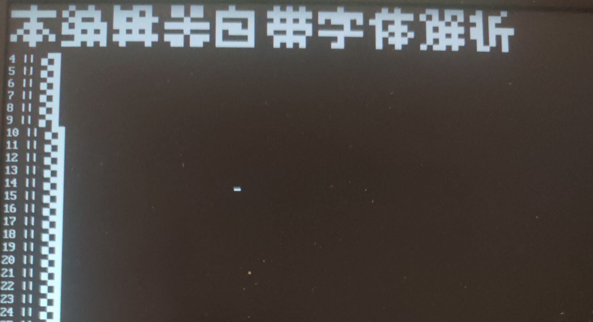
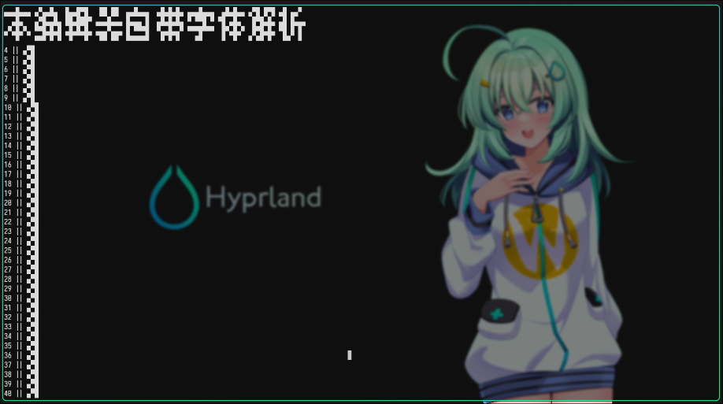

# kytris 

Keyboard Terminator Visual - where editing is a breeze, not a battle.

Powered By Rust.

不再让鼠标变成摆设的编辑器

基于 Rust 强大的支持鼠标输入的终端编辑器

本项目目前仅支持Linux系统，支持纯TTY界面(不需要中文字体包解析中文)

本项目没有使用其他第三方库包，仅使用了std标准库和libc库

A powerful terminal editor based on Rust that supports mouse input

The project currently only supports Linux(Windows=>WSL) and pure TTY interface
(NOT require UNICODE font)

Does not use other 3rd-party library packages
only the std std:: and libc::




## Usage

How to start: (require Root permission)
```
./kytris
```

Use external font library (support parse .bf/.bdf file ):\
.bf BemlyFont Bemly_Bitmap Font\
.bdf BitmapDistributionFormat Adobe Bitmap Font
(COMMON: used in itch.io pixel games)
```
./kytris -f .bf/.bdf file path
./kytris --font .bf/.bdf file path
```

Select the bounding keyboard and mouse input device:
```
./kytris -k </dev/input/event*> -m </dev/input/event*>
./kytris --key </dev/input/event*> ---mouse </dev/input/event*>
```

## Build

Compile binary files:
```
cargo run --package kytris --bin kytris
```

## Thanks

ISO 10646 Font: https://github.com/Angelic47/FontChinese7x7

## 使用方法

启动方法：(需要 Root 权限)
```
./kytris
```

使用外部字体库(支持.bf/.bdf文件解析):\
.bf     BemlyFont                   蓝莓现代位图字体文件\
.bdf    BitmapDistributionFormat   Adobe位图字库文件(itch.io像素小游戏常用)
```
./kytris -f .bf/.bdf文件路径
./kytris --font .bf/.bdf文件路径
```

指定绑定鼠标和键盘输入设备：
```
./kytris -k </dev/input/event*> -m </dev/input/event*>
./kytris --key </dev/input/event*> ---mouse </dev/input/event*>
```

## 编译

编译二进制文件：
```
cargo run --package kytris --bin kytris
```

## 鸣谢

字体文件支持：https://github.com/Angelic47/FontChinese7x7
